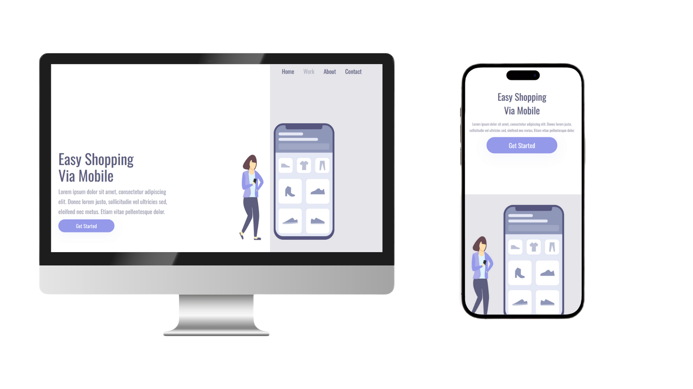

# 🛒 Easy Shopping via Mobile - Landing Page

Este é um projeto desenvolvido durante meus estudos de HTML, CSS e Git/GitHub pelo curso do DevClub. A proposta é uma landing page fictícia promovendo uma solução prática de compras via celular.

## 🖥️ Tecnologias utilizadas

- HTML5
- CSS3
- Git e GitHub
- Google Fonts (Oswald)

## 📱 Responsividade

O site é totalmente responsivo, adaptando-se a diferentes tamanhos de tela, especialmente em dispositivos móveis. O layout se ajusta automaticamente abaixo de 1366px de largura.

## 🎯 Funcionalidades

- Layout moderno com imagem ilustrativa
- Navegação fictícia com links de menu
- Design elegante, focado em usabilidade
- Botão de chamada para ação com estilo e interatividade
- Adaptação de conteúdo para telas menores

## 💡 Aprendizados

Durante o desenvolvimento deste projeto, aprendi a:

    Estruturar uma landing page com HTML semântico
    Estilizar com CSS utilizando boas práticas
    Aplicar flexbox para organização de layout
    Criar um design responsivo com media queries
    Trabalhar com Google Fonts e personalização visual
    Separar o código em arquivos organizados
    Melhorar minha leitura e escrita de código limpo

## 📷 Preview

## 📌 Status

✅ Finalizado.

---

### ✨ Próximos passos

Atualmente continuo estudando **JavaScript** e conciliando os estudos com meu trabalho atual. Novos projetos em breve!

---

## 📬 Contato

Se quiser falar comigo ou acompanhar minha evolução:

- [LinkedIn](https://www.linkedin.com/in/rafael-inui/)
- Email: contato.rafainui@gmail.com
